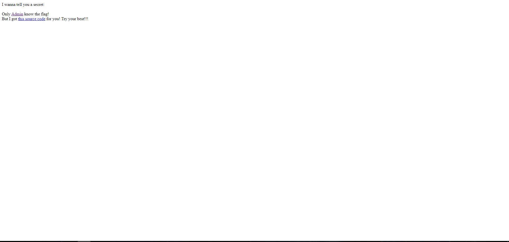
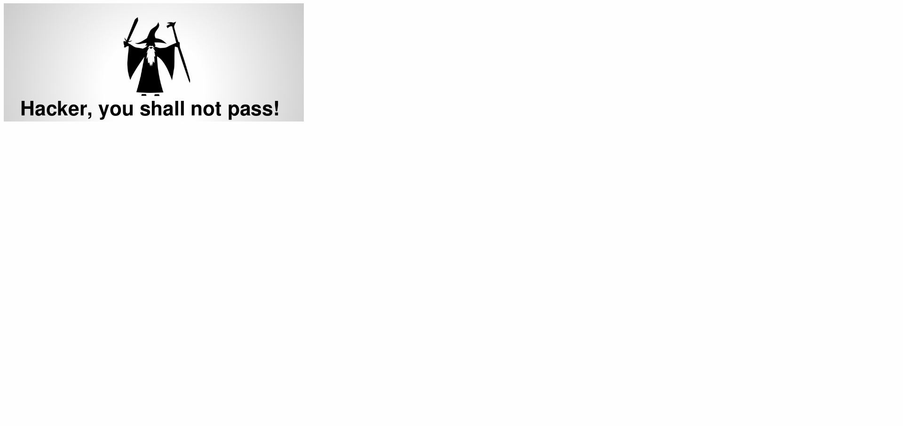
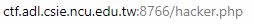
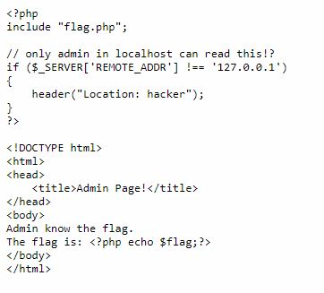
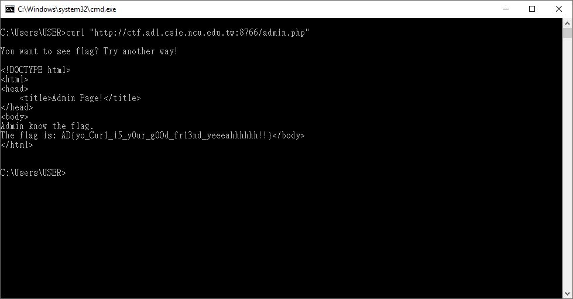

# Secret

First, we can see that this is a simple webpage with two url links for us to click.

So, let's look at the first link:

Well...there's a waring picture saying "Hacker, you shall not pass!"

And the current url looks like:

Hence, the hint should be in the second link:

Here, we can see that only if our address is local address could we pass the if statement.

However, we can see that the flag is actually printed no matter what. 

So, what I did was -- use curl.

There, we can print out the whole source code after executed.
