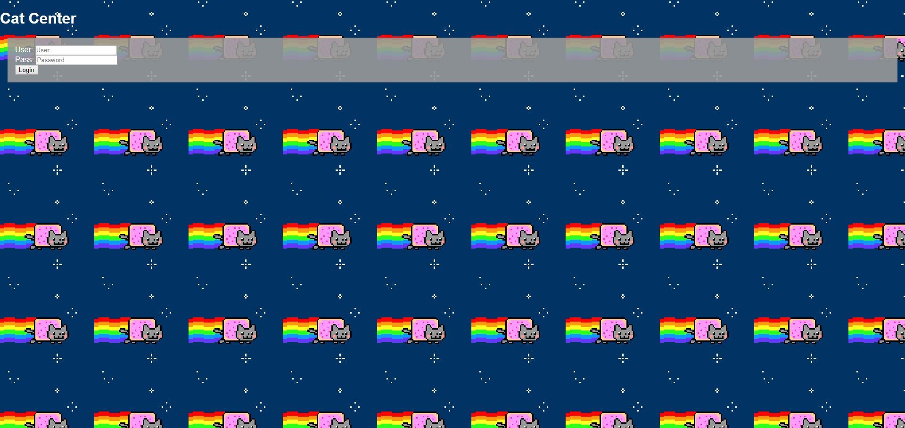
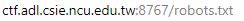
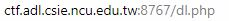
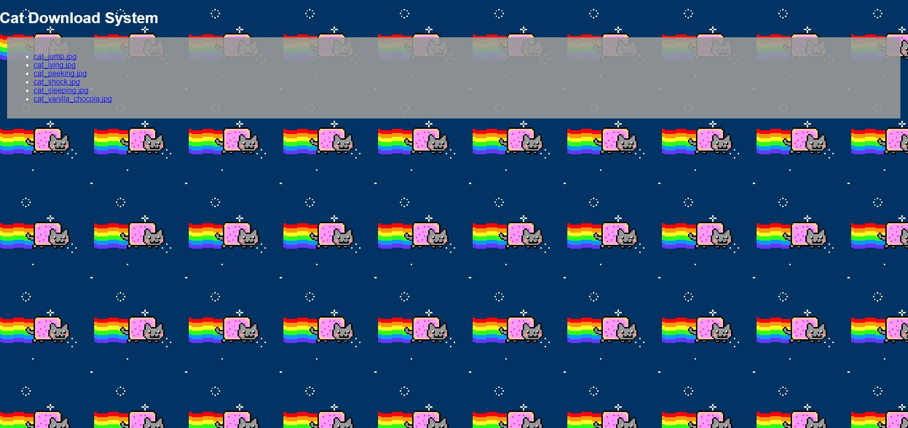
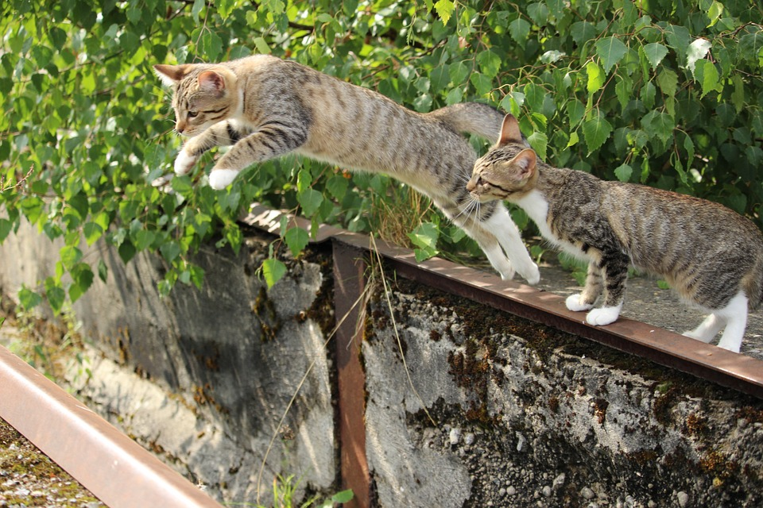
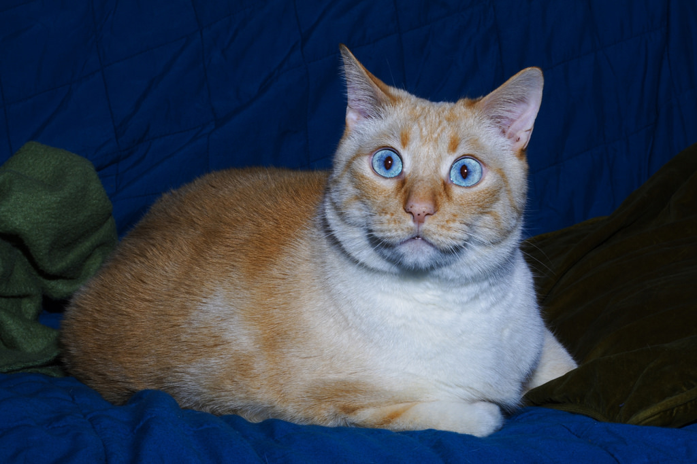
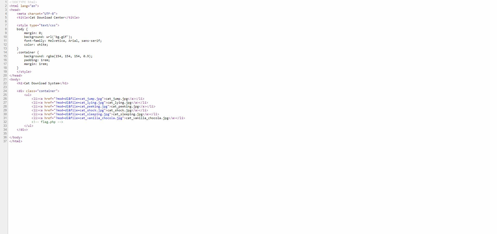

# Cat Center



Another login page, but let's try clicking the login button.


Oh! There's a hint telling us about `search engine robots`

So, `robots.txt` is what we need to enter in the url.


	
And Here's what we see --


Two disallows and one allow. So, let's take a look at the allow -- `dl.php`.





Hmmmmm, a Cat Download Center, and perhaps there's some hints in the pictures? 







But, the answer is ...... NO hints. So, let's look at the source code:



And found a hint :

```php
<div class="container">
    <ul>
        <li><a href="?mod=dl&file=cat_jump.jpg">cat_jump.jpg</a></li>
        <li><a href="?mod=dl&file=cat_lying.jpg">cat_lying.jpg</a></li>
        <li><a href="?mod=dl&file=cat_peeking.jpg">cat_peeking.jpg</a></li>
        <li><a href="?mod=dl&file=cat_shock.jpg">cat_shock.jpg</a></li>
        <li><a href="?mod=dl&file=cat_sleeping.jpg">cat_sleeping.jpg</a></li>
        <li><a href="?mod=dl&file=cat_vanilla_chocola.jpg">cat_vanilla_chocola.jpg</a></li>
        <!-- flag.php -->
    </ul>
</div>
```
Ok, so there's a file called `flag.php` and what should we do?

We can see that this is a DOWNLOAD CENTER, and from the source code, we can see how those pictures were downloaded.

```php
<a href="?mod=dl&file=XXX">
```

Thus, let's give it a try by replaceing the file name with `flag.php`

And....it WORKS!!

We got the file and saw the flag.

```php
<?php
$flag = "AD{d0wn1o4d_functi0n_Iz_veeryveeeery_D4NG3R}";
?>
```

	

	
