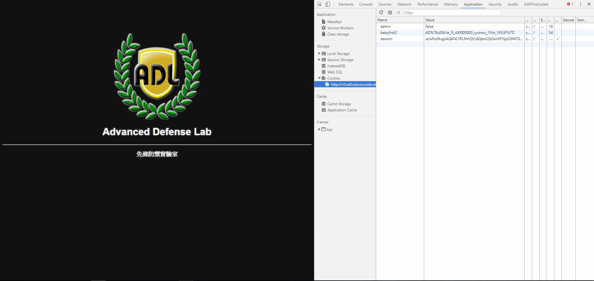

# BabyFirst2

When I click in the link again, I found that it was the same webpage as `BabyFirst1`.

Since the flag of `BabyFirst1` hid in the source code, this flag would not be there.

Thus, where can the flag be?

Cookies. The second way to hide a flag in a webpage.

So, how do we look at cookies? 

It's very simple. Again, the `Developer's Tool` or `F12`.

For Chrome, it's in Application section and you can find Cookies under Storage. Then click on the website your on.

And there we go! The second flag!

