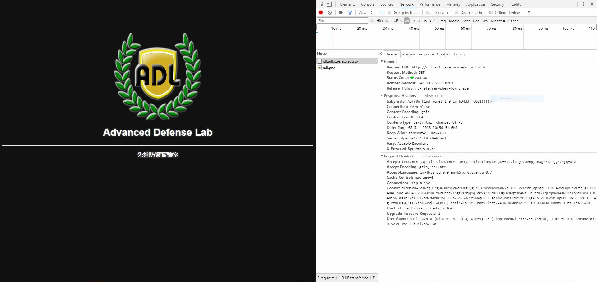
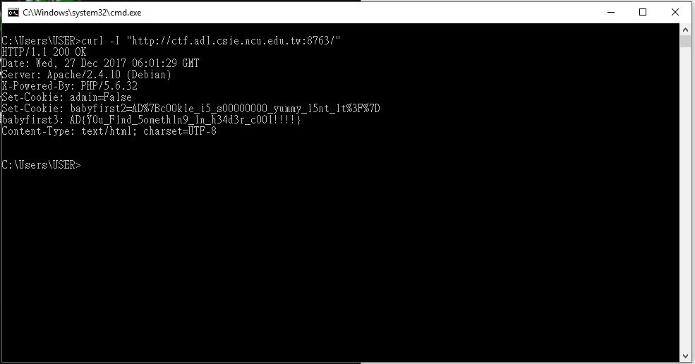

# BabyFirst3

Again!! It's the same webpage.

So, where can another flag hide????

It took a while for me to find out. 

Headers.

That is another place for a flage to hide.

How to we look at headers?

I have two ways:

ONE, use the `Developer's Tool` under Network section (have to refresh)--

ans TWO, use `curl -I`--

