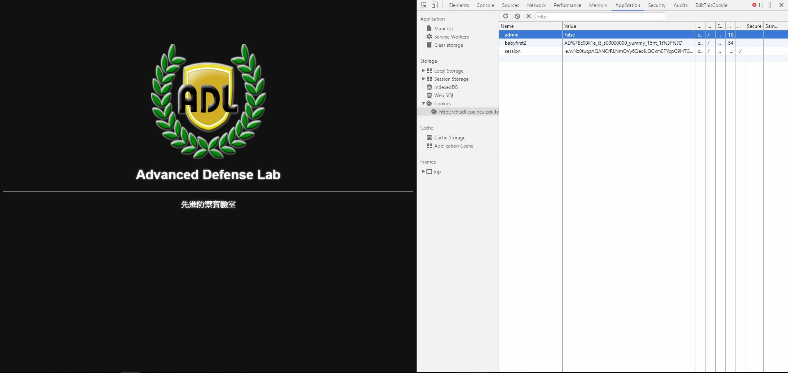
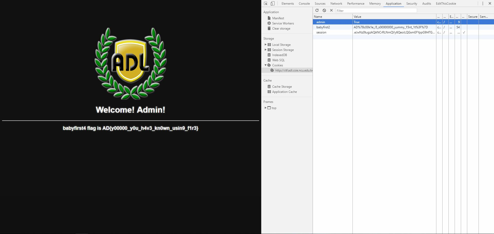

# BabyFirst4

ANOTHER SAME WEBPAGE!!!

Well, actually I sovled this before I found the flag hiding in headers for BabyFirst4.

It's quite obvius for this one. When we look at cookies and found the flag for BabyFirst2.

There we can see something interesting -- a cookie called admin, with a value of false.

What happens if we change it to true? This is quite a straightforward question.

Therefore, let's modify it into true, by just retyper it.

Then.....refresh the page and there we go!

